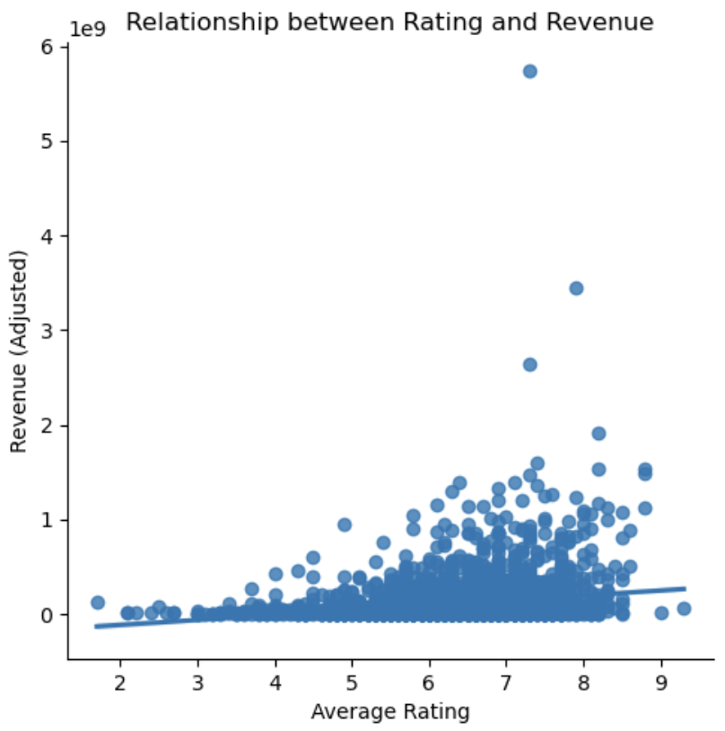

# A Star Cast is Born: Striking Gold with the Perfect Lineup

## Abstract
In movie-making, picking the right cast is key to a film's triumph. Our project sheds light on what directors should consider when casting. Central to our investigation is the effect of an actor's gender and ethnic mix on a movie's reception. We're also keen on finding the perfect age for characters, aiming for authenticity and relatability.

We go beyond mere talent, examining if an actor's fame and past awards can lift a film's ratings. Does having an award-winner or a star lead to better ratings? Alongside this, we look into how connections between actors affect a movie's charm.

Our analysis doesn't stop there. We also delve into the financial aspect, scrutinizing how these factors translate into box office revenues. This guide aims to equip directors with insights for assembling a cast that excels both in capturing hearts and at the box office, propelling a film to the peak of ratings. We will analyze the 25'515 movies that have been rated by IMDB users to create a recipe for a successful cast.

--- New Version --- 

How does actor fame influence movie rating?
- fame in terms of awards, online popularity and connections between actors

Talked about rating the whole time, but what about money? Is there any link between movie ratings and it's financial success? Let's quickly have a look.

Causation: Pair matching/propensity & sensitifity analysis

## Research Questions 🤨

