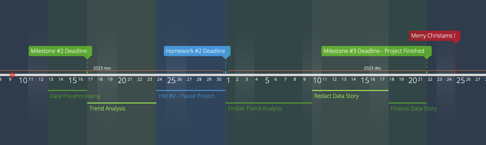

# A Star Cast is Born: Striking Gold with the Perfect Lineup

## Abstract
In movie-making, picking the right cast is key to a film's triumph. Our project sheds light on what directors should consider when casting. Central to our investigation is the effect of an actor's gender and ethnic mix on a movie's reception. We're also keen on finding the perfect age for characters, aiming for authenticity and relatability.

We go beyond mere talent, examining if an actor's fame and past awards can lift a film's ratings. Does having an award-winner or a star lead to better ratings? Alongside this, we look into how connections between actors affect a movie's charm.

Our analysis doesn't stop there. We also delve into the financial aspect, scrutinizing how these factors translate into box office revenues. This guide aims to equip directors with insights for assembling a cast that excels both in capturing hearts and at the box office, propelling a film to the peak of ratings.

## Research Questions 🤨
In our project, we define the success of a movie in terms of IMDB ratings. To provide the perfect cast, we will answer the following five questions:

1. How does an actor's `gender` and `ethnicity` influence the ratings of a film?
2. Ageing to Perfection: What is the optimal `age` for portraying specific character type?
3. Do stars make movies shine brighter? How does `popularity`, a previous nomination or `award` received by an actor impact the ratings of a movie?
4. How do `connections between actors` influence each other's contribution to movie ratings?
5. Is popularity everything? Do high ratings correspond to high `box-office revenue`?

## Additional Datasets 💽
1. IMDB [dataset](https://developer.imdb.com/non-commercial-datasets/): Ratings from IMDB. We are going to use the ratings as the dependent variable for our analysis. We merge it with each movie in the `movie.metadata.csv` by combining by `(name,release_year,runtime)` as unique key.
2. The Movies [dataset](https://www.kaggle.com/datasets/rounakbanik/the-movies-dataset?resource=download&select=movies_metadata.csv) for budgets, to isolate the influence of high rating in the `box office revenue`.
3. Awards [dataset](https://datahub.io/rufuspollock/oscars-nominees-and-winners#resource-oscars-nominees-and-winners_zip): This dataset contains all the winners and the nominees of the Oscars since 1927. It will be used to gauge the actors academically so we merged it with the `character.metadata.tsv` dataframe, to add the awards won until that movie by the actor.
4. Actor popularity [dataset](https://today.yougov.com/ratings/entertainment/fame/all-time-actors-actresses/all): `Fame`, `popularity`, `liked`, `disliked` and `neutral` ratios among US population (scrapped data).
5. Inflation [dataset](https://data.worldbank.org/indicator/FP.CPI.TOTL.ZG?end=2022&start=1960&view=chart): Consumer prices increase since 1960. This dataset will be used to adjust (`budget` and) `box office revenue` of the movies, mostly for our last question.

## Methods 📊

### Regression Analysis:
We would use regression analysis to model the relationship between actor’s gender and ethnicity and movie ratings. We would then be able to quantify the extent to which gender and ethnicity are associated with changes in movie ratings. We could also use it to create models to predict box-office revenue based on movie ratings and other factors.

### ANOVA (Analysis of Variance): 
This can help in comparing the means of movie ratings across different groups of actors based on gender and ethnicity.

### Cluster Analysis: 
Group movies based on character types and analyze the age distribution of actors in these roles to identify trends.

### Time Series Analysis: 
Analyze how an actor's win or nomination in awards influences the ratings of their subsequent movies.

### Network Analysis: 
By mapping out the connections between co-starring actors, we can analyze if and how these networks correlate with movie ratings. This analysis can reveal influential actors whose connections might positively or negatively impact the ratings.

### Correlation Analysis: 
We would use this method to find out if there's a statistical relationship between actors' connections and the ratings of movies they're in and to determine if high ratings are associated with high box-office revenue.

### General Pre-Processing
  1. Movie Metadata:
      - Added average rating from the IMBD dataset, adjust box office revenue with inflation in the US from the additional dataset to be able to compare them, implemented budget values and adjust them like box office. We also added the size of the cast, the number of awards/nominations of the cast and its average popularity and experience.
  2. Character Metadata:
      - Includes all actor data adjusted to the release date of the movie: age, awards, experience.
  3. Actor Data:
      - Collected all the following data per actor:
      - Popularity, %liked, %disliked, %neutral in the US population.
      - Total number of movies made
      - Number of awards/nominations
      - General data as birth, gender, height and etnicity.	

## Timeline ⏱️

## Milestones 🗿

### 1. Data Processing and Preparation
- **Task 1.1:** Adjust box office revenue and budget data for inflation to ensure temporal accuracy and comparability.
- **Task 1.2:** Integrate datasets to include actor popularity metrics and their awards history, focusing on their potential influence on movie ratings.
- **Task 1.3:** Standardize and clean data, ensuring consistency across different data sources.

### 2. Exploratory Data Analysis
- **Task 2.1:** Conduct descriptive statistical analysis to understand basic trends and distributions within the dataset.
- **Task 2.2:** Visualize key variables (e.g., actor age, gender, ethnicity, awards) to gain initial insights and identify potential patterns or outliers.

### 3. Analyzing Actor Demographics
- **Task 3.1:** Utilize regression analysis to examine the relationship between an actor's gender and ethnicity and the IMDB ratings of films.
- **Task 3.2:** Perform ANOVA to compare the mean ratings across different demographic groups of actors.

### 4. Character Type and Age Analysis
- **Task 4.1:** Conduct cluster analysis to group movies based on character types.
- **Task 4.2:** Analyze the age distribution of actors within these clusters using descriptive statistics to determine optimal ages for specific character types.

### 5. Impact of Awards and Popularity
- **Task 5.1:** Use time series analysis to evaluate the effect of an actor's awards history on subsequent movie ratings.
- **Task 5.2:** Employ correlation analysis to investigate the relationship between actor popularity and movie ratings.

### 6. Network Analysis of Actor Connections
- **Task 6.1:** Create a network graph of actors based on their co-starring roles.
- **Task 6.2:** Apply correlation analysis to assess how connections between actors affect movie ratings.

### 7. Relationship Between Ratings, Revenue, and Budget
- **Task 7.1:**  Investigate the correlation between movie ratings (as a proxy for popularity) and box office revenue, integrating budget data to enable a more nuanced analysis. This will allow for assessing how well a movie performs financially relative to its production costs.
- **Task 7.2:**  Use regression analysis to explore the impact of ratings on box-office revenue, while controlling for movie budget. This will provide insights into whether high ratings are associated with high revenue when accounting for production budgets.
- **Task 7.3:**  Perform comparative analysis to evaluate if movies with similar budgets but varying ratings have different revenue outcomes, further underscoring the role of ratings in financial success.

### 8. Development of Frontend for Data Visualization
- **Task 8.1:** Design and develop a frontend website that effectively visualizes the data story. This includes creating interactive charts and graphs to display key findings.
- **Task 8.2:** Ensure the website is user-friendly and accessible, with intuitive navigation and clear presentation of data insights.
- **Task 8.3:** Test the website for functionality and user experience.

### 9. Hosting and Deployment
- **Task 9.1:** Host the frontend on GitHub Pages, leveraging its integration with GitHub repositories for easy updates and version control.
- **Task 9.2:** Perform final testing post-deployment to ensure the website is fully operational and accessible online.

### 10. Reporting, Final Review, and Documentation
- **Task 10.1:** Compile findings, insights, and visualizations into comprehensive reports accessible through the website.
- **Task 10.2:** Conduct a final review of the analyses, website, and overall project.
- **Task 10.3:** Document methodologies, data sources, key findings, and the development process of the website.
- **Task 10.4:** Prepare final project deliverables, including the comprehensive report, data visualizations, and the fully functional website.

### 11. Project Closure
- **Task 11.1:** Ensure all project components, including the data analyses and frontend website, are complete and meet the project objectives.
- **Task 11.2:** Archive all project materials and code repositories in an organized manner for future reference or potential follow-up projects.
- **Task 11.3:** Conduct a project debrief with the team to reflect on successes, challenges, and learnings.

## Team Organization 👨‍👩‍👧‍👦
<!DOCTYPE html>
<html lang="en">
<head>
  <meta charset="UTF-8">
  <meta name="viewport" content="width=device-width, initial-scale=1.0">
</head>
<body>

  <table>
    <tr>
      <th>Member</th>
      <th>Tasks</th>
    </tr>
    <tr>
      <td>Emma</td>
      <td>README.md: Questions, Timeline, Team Organization</td>
    </tr>
    <tr>
      <td>Félix</td>
      <td>scraping of actors popularity dataset, methods and initial data merging</td>
    </tr>
    <tr>
      <td>Marine</td>
      <td>README.md: Abstract</td>
    </tr>
    <tr>
      <td>Tim B.</td>
      <td>Data pre-processing</td>
    </tr>
    <tr>
      <td>Tim W.</td>
      <td>Collection of datasets, Milestones, Front-End setup</td>
    </tr>
  </table>

</body>
</html>

## Questions for TA ❔

  - Could we drop all movies with no revenues (only 10% has), so we have a consistent dataset for all questions? Or should we use different datatset for each question?
  - Should we implement the same threshold for all question for charcaters, in other words, should we make a single dataset that fits every question? Or can we filter out per question, as an exemple, we remove character with no etnicity for the 1st questions but we keep them for the age question. 
